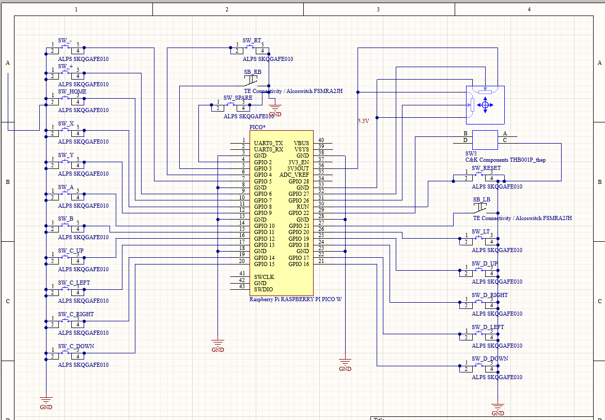

# Pico-Switch-Controller
DIY Nintendo Switch (and other systems) controller on a Raspberry Pi Pico

## Table of Contents

- [Description](#description)
- [Features](#features)
- [Hardware Limitations](#hardware-limitations)
- [Inspiration](#inspiration)
- [Setup](#setup)
- [Credits](#credits)

---

## Description

This code allows a Raspberry Pi Pico to control a Nintendo Switch (or other console) using button and joystick inputs connected to the Pico's GPIO pins. Once you have the Pico and the code it can be used for a multitude of things. You can edit the code or if that is not a strong point connect the Pico to an other microcontroller to automate mind-numbing tasks in games like shiny hunting in Pokemon, or jumping rope in Mario, ect. If you have access to a 3d printer you can make your own controller or arcade fight stick. I designed and had PCB made for this but it can just as easily be done on proto board and hand soldering wires. This could be use to built cheep easy custom controllers for anyone. I know just enough to get by and used a lot of resources and the projects of others that I will provide links to, so don't criticize the code too harshly. 

## Features

Feature list for this project
- Connects to a Nintendo Switch via USB.
- Will also work on any platform that supports a USB game pad (although some of the buttons may not translate over in the same configuration)
- Fast input responce time for fighting games
- Set up can be as easy as draging and drropping the .uf2 file on to a Pico.
- Scalable inputs for the Left analog stick that can be adjusted to personal preference or to overcome hardware limitations.

## Hardware Limitations

The Pico has 4 analog inputs. Initially I thought this would be great two for the Left Analog Stick X and Y axis, and two for the Right Analog Stick X and Y axis. However it turns out that one of the analog inputs is internal to the RP2040 chip on the Pico and used to read a thermistor. So I was limited to only 3 analog inputs. I choose to use 2 of them for the Left Analog Stick and for the Right Analog Stick I just made them digital buttons. That is not a great solution but was good enough for what I was planning to do. If anyone is feeling ambitious there are extra pins that could be tied to a ADC and read in.

## Inspiration

There have been a lot of things in games that I have thought “It would be nice if this could be automated.” So I started looking around to see if that has been done before. I found a few similar projects that utilize a Teensy board microcontroller to basically do the same thing as this one. Always thought the idea was fun but never wanted to spend the money for one. Not that they are all that expensive but the Pico is 1/4th the cost.  I was able to build a functioning controller for less than 15$ that is less than the cost of a Teensy. I have included a list of parts that I used below. 

- SC0915 Pico 4$
- THB001P Analog Stick 2$
- PTS526SK15SMTR2 LFS Push Buttons 0.13$ x12
- 431256038716 Right Angle Push Button 0.52$ x4

## Setup

To program the Raspberry Pi Pico

1. Hold down the boot sel button on the Pico, and while holding, plug it into your PC via Micro USB cable. (after it has been plugged in you no longer need to hold the boot sel button)
2. Open the Pico in your File Explorer.
3. Download the .uf2 file from this project
4. Drag and drop the .uf2 file to the Pico folder from step 2.
5. Now if you use the the USB cable to connect the Pico to any computer or Nintendo Switch it should register as a controller. That can be tested [here](https://hardwaretester.com/gamepad).
7. Now all that is left is to wire up buttons to the GPIO pins on the Pico and if you want print/build an enclosure for it.

 
 

For the left analog stick you should wire the 3.3(Out) (Pin 36) to one end of the analog stick X and Y potentiometers, and the analog ground (pin 33)| to the other. Then you should connect the X and Y pins (32 and 31) to their respective wipers.

For all of the other buttons they are set with an internal pull up resistor, this means that you just need to connect their pins to any ground pin to activate them.

If you would like to edit the code I have included all of the source code use to build the .uf2 file as well as the make files that were used. I was using the pico visual studio platform on a windows machine. 

## Credits 
a lot of the work was already done on the the [Retro Pico Switch](https://github.com/DavidPagels/retro-pico-switch) project. I used this as my starting point, along with the creators and contributors of [TinyUsb](https://github.com/hathach/tinyusb), the [GP2040-CE](https://github.com/OpenStickCommunity/GP2040-CE) project, and the [MPG](https://github.com/OpenStickCommunity/MPG) project.

   

